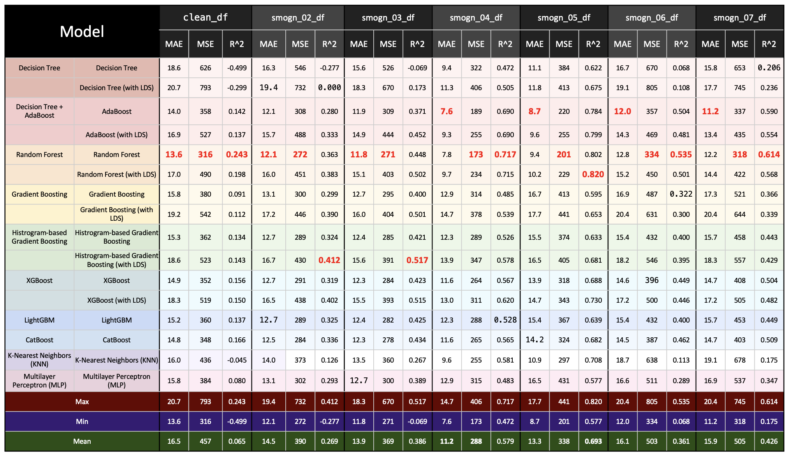

# SC1015 Project FCE3 Team1
#### Members:
- Kongkijpipat Peeranat &nbsp;&nbsp;(U2323360A)
- Juirnarongrit Nathan &nbsp;&nbsp;&nbsp;&nbsp;(U2321878E)
- Chananam Kulpatch &nbsp;&nbsp;&nbsp;&nbsp;&nbsp;(U2320130D)
  
# About
In this project, we discovered a <a href='https://www.kaggle.com/datasets/maharshipandya/-spotify-tracks-dataset?resource=download'>Kaggle dataset of Spotify songs</a> (`./data/dataset.csv`), which contains 20 features of the songs measured by Spotify. Our aim is to predict the songs' popularity based on the other features. Throughout the EDA, we have done data preprocessing using cutting-edge techniques (SMOGN and DIR) to deal with imbalanced distribution. Lastly, we decided to use different regression models to find the best model, which we will discuss later.

# Exploratory Data Analysis
The dataset has 114,000 data points and 20 features:
- Unstructured data: `track_id`, `artists`, `album_name`, `track_name`, `track_genre`.
- Categorical data: `explicit`, `mode`, `key`, `time_signature`.
- Numberical data: `popularity`, `duration_ms`, `danceability`, `energy`, `loudness`, `speechiness`, `acousticness`, `instrumentalness`, `liveness`, `valence`, `tempo`.

The first thing we did is taking a look at the distribution of `popularity` by KDE plot, where we noticed the imbalance in our data, as there are many songs with `popularity = 0`.

Next, we examined the correlation between `popularity` and other features, including numerical and categorical data. We found that every feature has very low correlation with `popularity`, which means the simple models like linear regression or logistics regression may not work well on this dataset.

## Data Cleaning
We realized that one song can have different variations, such as `explicit` and cover version; however, there are some data points that have the same `track_id`, so we removed the duplicates from our dataset. Moreover, we decided to use only numerical data for our prediction to simplify our model. 

Therefore, we cleaned our dataset by the following:
- Excluding duplicate songs: As the same song can have different variations, we drop only the same `track_id`.
- Dropping unstructured and categorical data.

## Imbalanced Data
After cleaning the data, next step is to deal with imbalanced distribution of `popularity`. Throughout the research, we discovered two new techniques that we will apply to our data, including [Synthetic Minority Over-Sampling Technique for Regression with Gaussian Noise (SMOGN)](https://github.com/nickkunz/smogn) and [Deep Imbalanced Regression (DIR)](http://dir.csail.mit.edu/)

# Machine Learning Models

As the purpose of this project is to predict `popularity`, we decided that regression model is the the most appropriate. Our selected models are the following:

1. Decision Tree
2. AdaBoost
3. Random Forest
4. Gradient Boosting 
5. Histogram-based Gradient Boosting 
6. XGBoost
7. LightGBM 
8. CatBoost
9. K-Nearest Neighbors (KNN)
10. Multilayer Perceptron (MLP)
 
We trained these models and measured their performance by $MAE$, $MSE$, and $R^2$.

# Results

# Limitations
- Hyperparameter tuning for each model
- Try to use manual tunning in SMOGN 
- More features included such as artist popularity, album popularity
- Include categorical data using One-Hot Encoder 
- Implement FDS to all epochs training 
- Implement LDS to KNN and MLP  
- Include unstructured data by using NLP model such as DistilBERT

# References
- [Spotify Dataset](https://www.kaggle.com/datasets/maharshipandya/-spotify-tracks-dataset?resource=download)
- [Synthetic Minority Over-Sampling Technique for Regression with Gaussian Noise (SMOGN)](https://github.com/nickkunz/smogn)
- [Deep Imbalanced Regression (DIR)](http://dir.csail.mit.edu/)
- [Scikit Learn](https://scikit-learn.org/stable/)
- [XGBoost](https://xgboost.readthedocs.io/en/stable/)
- [LightGBM](https://github.com/microsoft/LightGBM)
- [CatBoost](https://github.com/catboost/catboost)